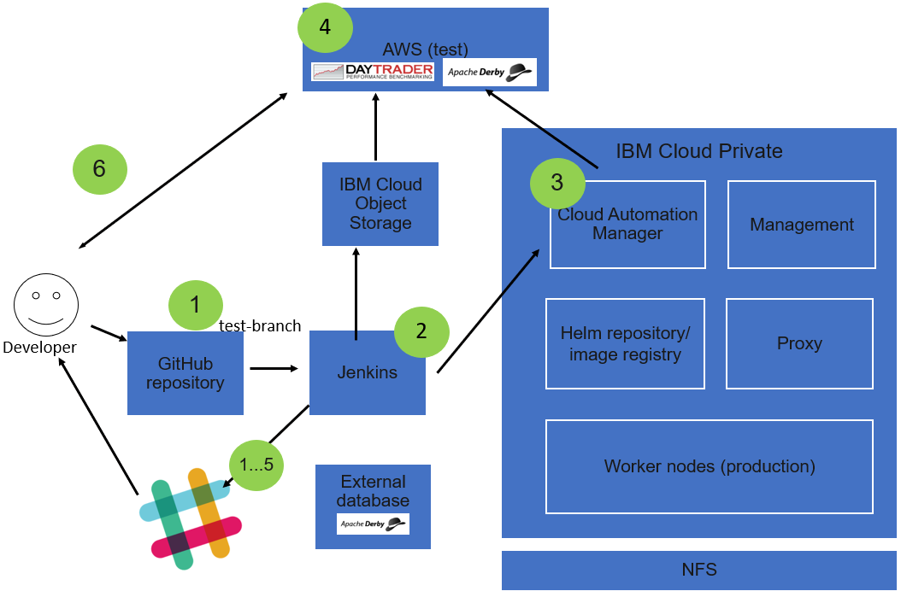
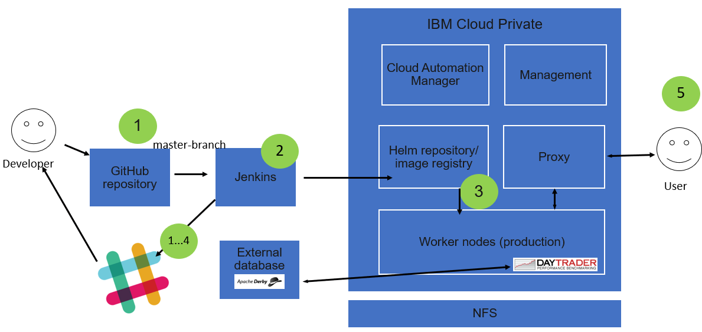

# icp-cam-devops-demo

The idea of this demo is to show how IBM Cloud Private and IBM Cloud Automation Manager can be used as part of the DevOps pipeline in multi-cloud environment. Multi-cloud in this context means on-premise private cloud and public AWS.

The application used in this demo environment is [Daytrader, a JEE7 application](https://github.com/samisalkosuo/sample.daytrader7).

The guiding lights of this demo are:
  - when developer commits & pushes to test-branch --> automatic deployment to AWS.
    
  - when developer commits & pushes to master-branch --> automatic deployment to ICP.
    

Both IBM Cloud Private (ICP) and IBM Cloud Automation Manager (CAM) used in this demo are publicly available Community Editions. When using licensed versions of ICP and CAM, their deployment is a bit different but mostly the same steps apply. 

The steps below, as well as scripts and other files are written using ICP version is 3.1.1 and CAM 3.1.0.

## Setup

Assumption is that demo setup is created from scratch using Linux servers. 

<small>(Except... these instructions were written after uninstalling existing ICP 3.1.0 (that was upgraded from 2.1.0.3) environment so servers, Jenkins, NFS and others already existed.)</small>

Demo servers are Ubuntu Linux servers, CentOS/RHEL could be used too. 

Total of 8 servers, and they are:

- ICP boot node, including:
  - Jenkins
  - Database
  - in real life, all of these would be separate servers but for demo purposes, this is fine
- NFS server
  - to be used as storage for CAM and other workloads
- 6 servers for ICP
  - master, management, proxy, 3 worker nodes
  - vulnerability advisor is not included in ICP Community Edition, but it would be useful in production environments
- Minimum server requirements:
  - Ubuntu or RHEL/CentOS (others may work too)
    - Ubuntu is better choice, sample scripts in this repo are mostly for Ubuntu
  - 8 CPU
  - 16GB RAM
  - 100GB disk

In addition to servers, the following services are used:
- IBM Cloud - IBM Cloud Object Storage
  - Make note of [IBM Cloud Identity and Access Management](https://cloud.ibm.com/docs/iam/index.html#iamoverview).
  - You may need to modify access rights. 
  - If AWS deployment fails, step "Test deployment to AWS" in Jenkins should show errors related to access rights.
- AWS EC2
- GitHub
- Slack

## Install the demo environment

Starting from scratch, installing the demo environment is an effort. But outcome will be well worth the effort :-)

1. Provision servers.
   - If possible, do not use firewalls in this demo environment.

1. Use one of the servers as the ICP boot node.
   - This is also Jenkins server and simulates external database.

1. [Prepare servers, as needed](https://www.ibm.com/support/knowledgecenter/SSBS6K_3.1.1/installing/prep.html)

1. [Install IBM Cloud Private CE](https://www.ibm.com/support/knowledgecenter/SSBS6K_3.1.1/installing/install_containers.html).
   - Setup nodes and install as instructed.
   - [hosts](icp/hosts) and [config.yaml](icp/config.yaml) are samples.

1. Setup NFS server in one of the servers.
   - If using Ubuntu, [good instructions are here](https://help.ubuntu.com/community/SettingUpNFSHowTo).
   - [Sample script to set up NFS server](scripts/nfs_server_setup.sh).

1. Setup NFS client on ICP nodes.
   - Make note to allow NFS traffic through firewall(s).
   - [Sample script to set up and test NFS client](scripts/nfs_client_setup.sh).
   - Create NFS shared directory in all worker nodes.
     - For example: ```/icp_shared```

1. Install command line tools to ICP bootnode:
   - ICP includes the required tools and they can be downloaded from ICP.
   - CLI tools used:
     - ```cloudctl```
     - ```kubectl```
     - ```helm```
     - ```istioctl```
     - ```calicoctl```
   - The script [install_icp_cli.sh](scripts/install_icp_cli.sh) can be used to install CLI tools.
   - These tools are also used by Jenkins.

1. Configure Docker private registry access from ICP boot node:
   - install ICP certificate, [instructions here](https://www.ibm.com/support/knowledgecenter/SSBS6K_3.1.1/manage_images/configuring_docker_cli.html).
   - Cert file is in master node and usually located here:
     - ```/etc/docker/certs.d/mycluster.icp:8500/ca.crt```

1. Set up StorageClass for dynamic hostpath provisioning 
   - Make sure that shared directory is in all worker nodes, for example: ```/icp_shared```
   - My dynamic hostpath provisioner,which is based on other projects, is used here.
     - https://github.com/samisalkosuo/k8s-dynamic-hostpath-provisioner
     - Make note of limitations of using this kind of dynamic provisioning.
   - Follow the instructions to set up a StorageClass.

1. Install CAM Community Edition
   - https://www.ibm.com/support/knowledgecenter/SS2L37_3.1.0.0/cam_install_CE.html
   - Follow the instruction to install CAM.
   - In order to use dynamic provisioning, when configuring Helm chart using ICP UI, remember to enable "Use Dynamic Provisioning".
     
1. Install external database for Daytrader:
   - This simulates production database.
   - In the boot node:
     - ```git clone https://github.com/samisalkosuo/sample.daytrader7.git```
     - Go to *sample_database* directory
     - Build Docker image: ```docker build -t daytrader_db .```
     - Run it: ```docker run -d --restart always -p 1527:1527 daytrader_db```

1. Install Jenkins:
   - https://jenkins.io/doc/book/installing/
   - Assumption here is that Jenkins is installed natively (no Docker container).
   - Jenkins uses host OS to build application (using Docker, IBM Cloud CLI, kubectl, etc that is installed in host OS and available for jenkins-user).
   - Sample script to install: [jenkins_install.sh](scripts/jenkins_install.sh)
     - Scripts adds jenkins-user to Docker users, restarts Jenkins and installs ICP CLI plugin for jenkins-user.

1. In addition to the components above, you need: 
   - AWS account and AWS access key and secret key.
   - Slack account to create new channel
   - GitHub account to fork existing repository.
   - IBM Cloud account to store binaries in Cloud Object Storage.
     - IBM Cloud API key is needed.
     - **Note**: Jenkins-build creates automatically IBM Cloud Object Storage service using Lite-plan. If you already have Cloud Object Storage service Jenkins build will fail.

Now the basic components are installed: IBM Cloud Private, IBM Cloud Automation Manager and Jenkins. The next step is to configure the environment.

## Configure the demo environment

Configuration includes setting up all the components so that automatic deployment happens when developer commits code. 

### GitHub

In order to use the demo, you need an application in GitHub. Fork [sample Daytrader application](https://github.com/samisalkosuo/sample.daytrader7) and use your own fork when using this demo.

The sample application includes Jenkinsfile, Dockerfile and other configuration for this demo.

### Cloud Automation Manager

1. Configure CAM:
   - [Connect to AWS cloud](https://www.ibm.com/support/knowledgecenter/SS2L37_3.1.0.0/cam_managing_connections.html)
     - Use connection name: ```AWSFrankfurt```
     - Remember to select Frankfurt region.
   - You need AWS access key ID and secret access key.

1. Create CAM template:
   - [Documentation](https://www.ibm.com/support/knowledgecenter/SS2L37_3.1.0.0/cam_managing_templates.html) includes steps to create template. It is quite straight-forward task.
   - Create template from GitHub.
   - GitHub Repository URL: ```https://github.com/samisalkosuo/icp-cam-devops-demo```
   - GitHub Repository sub-directory: ```cam/template```
   - Click "Create".
   - Display name: ```DaytraderAWS```
   - Description: ```Daytrader application at AWS Frankfurt.```
   - Cloud provider: ```Amazon EC2```
   - Click "Save".
   
1. Create CAM service:
   - CAM service can include many templates but, in this context, only the template created in previous step is used.
   -  [Documentation](https://www.ibm.com/support/knowledgecenter/SS2L37_3.1.0.0/cam_managing_services.html) includes steps to create service. 
   - Use "Create a Service" to create new service.
   - You must use service name: ```DaytraderAtFrankfurt```
     - Because this is hardcoded in Daytrader Jenkins build :-)
   - Import [service JSON file](cam/service/daytrader_at_frankfurt.json) as source.
   - Edit template parameters (in Parameters-tab, under "Activity Parameters"):
     - replace *ADD YOUR AWS ACCESS KEY HERE* with your own AWS access key.
     - replace *ADD YOUR AWS SECRET ACCESS KEY HERE* with your own AWS secret access key.
   - Click "Save" and then click "Publish".

You may test template and service from CAM UI, but in order it to work correctly you need to have an application URL where to download Docker image. It's better to follow these instructions to the end :-)

### Jenkins

1. [Install Blue Ocean plugins](https://jenkins.io/doc/book/blueocean/getting-started/).
1. Configure Slack:
   - [Follow these instructions](https://github.com/jenkinsci/slack-plugin).
   - Use slack channel name: *#deployments*   
     - Because this is hardcoded in Daytrader Jenkins build :-)     
   - When testing connection and you get client error, check this script: [jenkins_configure_certs.sh](scripts/jenkins_configure_certs.sh)
1. Add following global environment variables to Jenkins:
   - ICP_URL - URL to ICP admin console (like https://server.ip:8843).
   - CAM_URL - CAM URL. Default URL is like https://proxy.server.ip:30000.
   - ICP_PROXY_IP - ICP proxy node IP address.
   - CAM_USER - admin user name for both CAM and ICP (default is typically 'admin')
   - CAM_PASSWORD - password for CAM and ICP (assumes that admin-user can access both)
   - DAYTRADER_DB_IP - IP address where Daytrader external database is running. Must be accessible from ICP worker nodes.
   - IBMCLOUD_API_KEY - [IBM Cloud API key](https://console.bluemix.net/iam/#/apikeys) to login to IBM Cloud from CLI.
     - Reminder:
       - Make note of [IBM Cloud Identity and Access Management](https://cloud.ibm.com/docs/iam/index.html#iamoverview).
       - You may need to modify access rights. 

1. Open Blue Ocean and create a new pipeline from [Daytrader GitHub repository](https://github.com/samisalkosuo/sample.daytrader7):
   - Sample steps to create a pipeline from GitHub repository is: [here](https://jenkins.io/doc/tutorials/create-a-pipeline-in-blue-ocean/#create-your-pipeline-project-in-blue-ocean)
   - When you've created the pipeline, build processes start for both develop and master branches.
   - Remember to set GitHub polling:
     - Select pipeline settings and Scan Repository Settings and set interval to 1 minute.
     - This enables automatic deployment after commit, with only small delay :-)

If everything was installed and configured correctly, you'll get notified via Slack channel about build processes and eventually see Daytrader application appearing in AWS and ICP.

